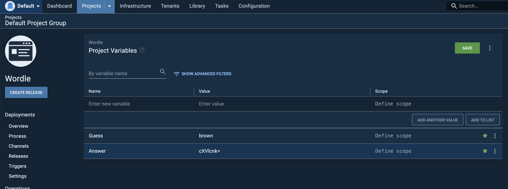

# How to Play Wordle Using Octopus Deploy

1. Start an Octopus instance, create a project and name it `Wordle`(name doesn't matter...).

2. Create 5 environments, name them `1` ~ `5`. Remove any other environments.

3. Download the `generate-answer.js` file in this repo, and run it locally with Node (`$ node ./generate-answer.js`). This will give you a random base64-encoded 5-letter word, this is the answer you will be trying to guess.

4. In project variables, create the following variables. `Answer` is the base64-encoded word you just got from last step. `Guess` is your first guess ("brown" in my case). You will be changing this value in each round until you get the correct answer. `Index` is environment-scoped. Its value is the same as the environment names.

5. In the "Process" section, add a "Run a Script" step. Use Powershell as the language and copy over the content of `script.ps1` file in this repo. Make sure you select "Run on Octopus Server" if you use a local Octopus instance.

6. Create a release. For clearer output, set the version of the release the same as your guess ("brown" for example). Deploy it to all 5 environments.

7. Go back to the "Overview" section. A successful deployment means the letter is in the answer and in correct spot. A "successful with warning" deployment means the letter is in the answer, but in a wrong spot. A failed deployment means the letter is not in the answer.

8. Change the value of the `Guess` variable and deploy again. Repeat this process until you get 5 successful deployments!

